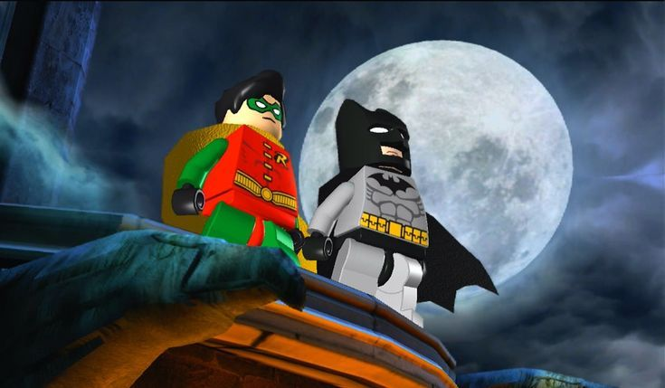
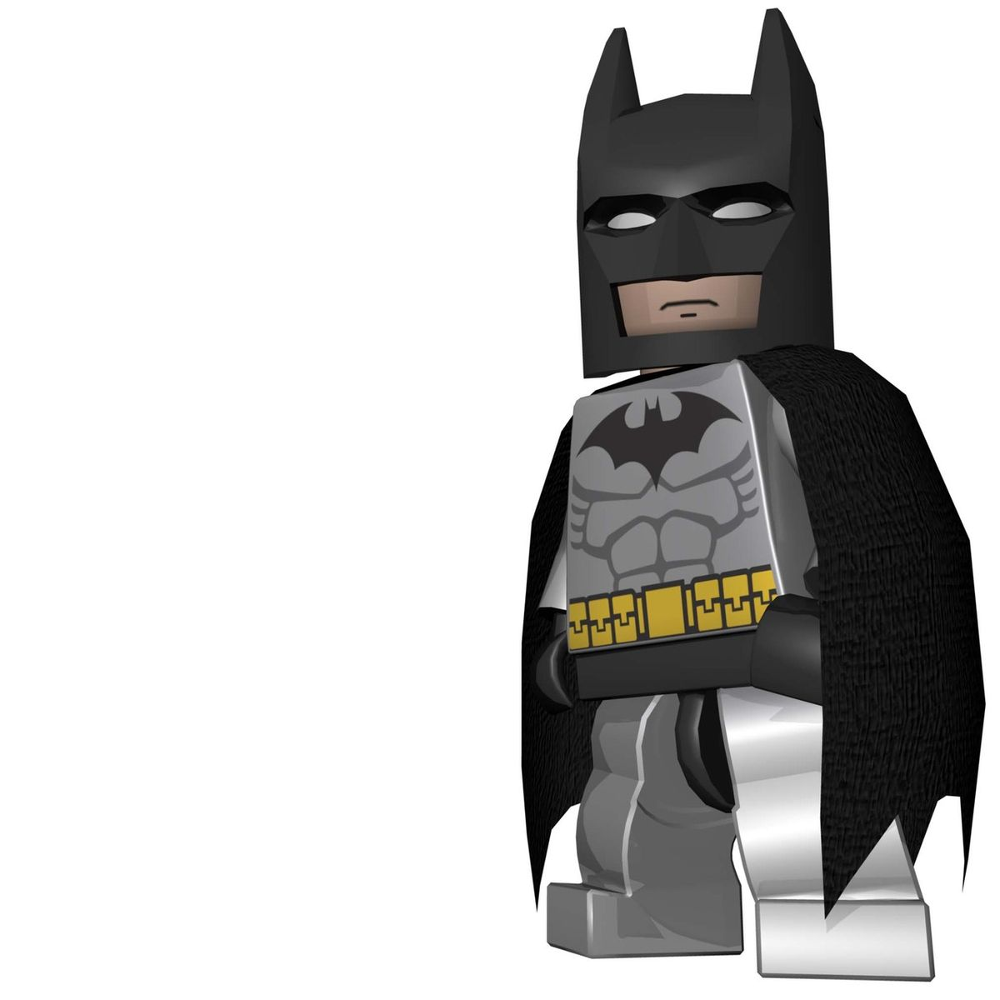

  

<h1 align="center">Guilherme D.</h1>

  <i>🎓 Computer Science Student @ PUC Minas (1/8)</i>

  
  
  

<h3>About me</h3>

> "Se estiver se sentindo desmotivado ou sentindo que não é bom o suficiente, incendeie o seu coração, enxugue as lágrimas e siga em frente.
>
> Quando se entristecer ou se acovardar lembre-se que o fluxo do tempo nunca para, ele não vai te esperar enquanto você se afoga em tristeza."

 

### Connect me

  

  

  

  

<h3 align="center">Github Status</h3>

 

