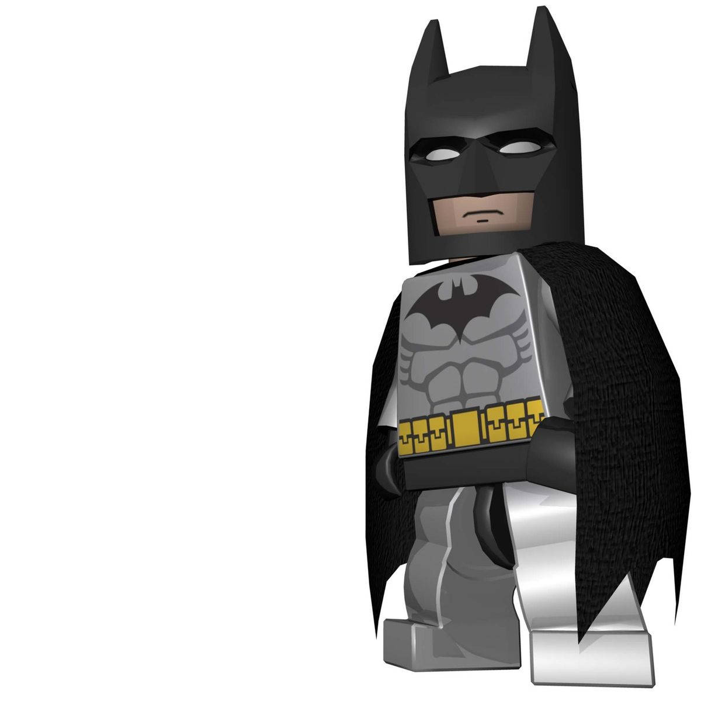

  

<h1 align="center">Guilherme D.</h1>

  <i>🎓 Computer Science Student @ PUC Minas (1/8)</i>

  
  
  

<h3>About me</h3>

> . . . Practice any art, music, singing, dancing, acting, drawing, painting, sculpting, poetry, fiction, essays, reportage, no matter how well or badly, not to get money and fame, but to experience
> becoming, to find out what's inside you, to make your soul grow.
> Seriously! I mean starting right now, do art and do it for the rest of your lives. Draw a funny or nice picture of Ms. Lockwood, and give it to her. Dance home after school, and sing in the shower and on and on. Make a face in your mashed potatoes. Pretend you're Count Dracula.

 

### Connect me

  

  

  

  

<h3 align="center">GitHub Status</h3>

  

  

